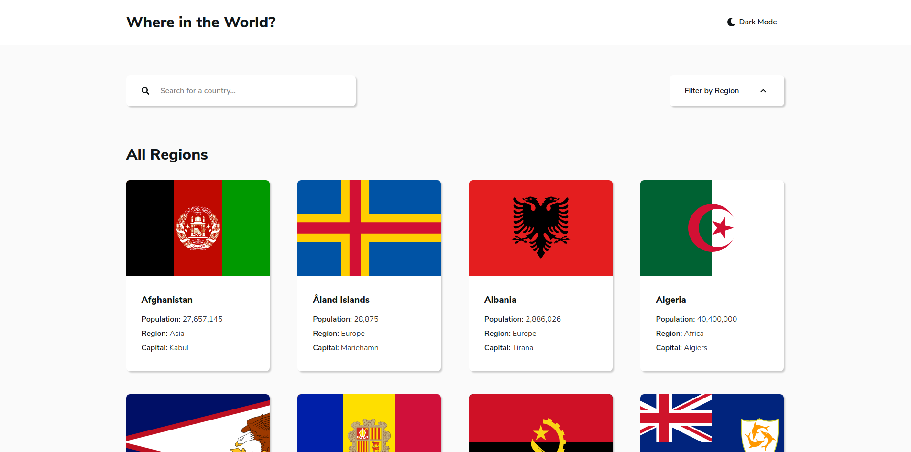

# Frontend Mentor - REST Countries API with color theme switcher solution

This is a solution to the [REST Countries API with color theme switcher challenge on Frontend Mentor](https://www.frontendmentor.io/challenges/rest-countries-api-with-color-theme-switcher-5cacc469fec04111f7b848ca). Frontend Mentor challenges help you improve your coding skills by building realistic projects.

## Table of contents

- [Overview](#overview)
  - [The challenge](#the-challenge)
  - [Screenshot](#screenshot)
  - [Links](#links)
- [My process](#my-process)
  - [Built with](#built-with)
  - [What I learned](#what-i-learned)
  - [Continued development](#continued-development)
- [Author](#author)
- [Acknowledgments](#acknowledgments)

## Overview

The challenge was to create an site to consume an API with countries data

### The challenge

Users should be able to:

- See all countries from the API on the homepage
- Search for a country using an `input` field
- Filter countries by region
- Click on a country to see more detailed information on a separate page
- Click through to the border countries on the detail page
- Toggle the color scheme between light and dark mode

### Screenshot

### Links

- [Live Site](https://frontend-mentor-countries.herokuapp.com/)

## My process

I try to create all the interface first, I used JSON Server to fake the data that the API will return. It's a good practive because some API's have limited requests per user.

After the interface I start work in the Contexts, I create three of them. One the theme, one for the data and one for the modal. I decided to do that because I wanna try to work with multiple contexts in the same application.

### Built with

- Semantic HTML5 markup
- CSS custom properties
- Flexbox
- CSS Grid
- [React](https://reactjs.org/) - JS library
- [Styled Components](https://styled-components.com/) - For styles

### What I learned

I could practice the basics of React with this project, I use hooks and the Context API. It was good oportunity to work with Styled-Components theme feature.

### Continued development

I pretend to improve this project adding Next.js in the near future, SSG will be great because the content practily never changes.

## Author

- Frontend Mentor - [brGuirra](https://www.frontendmentor.io/profile/brGuirra)
- LinkedIn - https://www.linkedin.com/in/bruno-guirra-7766b6209/

## Acknowledgments

If you are someone doing this challenge too, this [post](https://medium.com/rbi-tech/theme-with-styled-components-and-typescript-209244ec15a3) helped me a lot when I had to create the themes with Styled-Components, could save you some time :blush:
